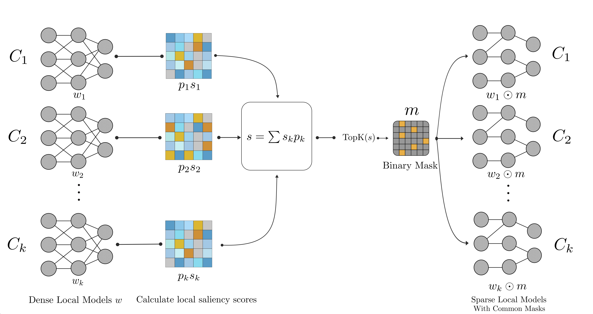

# SSFL: Discovering Unified Sparse Subnetworks at Initialization for Efficient Federated Learning

[](https://openreview.net/forum?id=kUZ6LhUB26) 
[](https://opensource.org/licenses/MIT)

**Authors:** Riyasat Ohib, Bishal Thapaliya, Gintare Karolina Dziugaite, Jingyu Liu, Vince D. Calhoun, Sergey Plis
<br>

## Abstract

In this work, we propose **Salient Sparse Federated Learning (SSFL)**, a streamlined approach for sparse federated learning with efficient communication. SSFL identifies a sparse subnetwork prior to training, leveraging parameter saliency scores computed separately on local client data in non-IID scenarios, and then aggregated, to determine a global mask. Only the sparse model weights are trained and communicated each round between the clients and the server. On standard benchmarks including CIFAR-10, CIFAR-100, and Tiny-ImageNet, SSFL consistently improves the accuracy–sparsity trade-off, achieving more than 20\% relative error reduction on CIFAR-10 compared to the strongest sparse baseline, while reducing communication costs by $2 \times$ relative to dense FL. Finally, in a real-world federated learning deployment, SSFL delivers over $2.3 \times$ faster communication time, underscoring its practical efficiency.

------

## Installation

### Requirements

- Python 3.10+
- [uv](https://github.com/astral-sh/uv) (fast Python package installer)
- PyTorch with CUDA support (installed automatically)
- CUDA-capable GPU (recommended)

### Setup

1. Clone this repository:
```bash
git clone https://github.com/riohib/SSFL.git
cd SSFL
```

2. Install dependencies using `uv`:
```bash
bash setup.sh
```

This will:
- Create a virtual environment (`.venv`) with Python 3.10
- Install PyTorch with CUDA 12.8 support
- Install all project dependencies

To use a different CUDA version:
```bash
CUDA_VERSION=cu128 bash setup.sh
```

3. Activate the environment:
```bash
source .venv/bin/activate
```

---

## Quick Start

### Running a Basic SSFL Experiment

Here's a minimal example to run SSFL on CIFAR-10 with default settings:

```bash
# Set experiment parameters


# Run SSFL
python main.py \
    model.dense_ratio=0.3 \
    training.client_num_in_total=100 \
    training.frac=0.1 \
    training.epochs=5 \
    training.comm_round=1000 \
    experiment.seed=550 \
    wandb.exp_name="SSFL_dsn0.5"
```

**What this does:**
- Runs SSFL with static masking
- Uses ResNet18 on CIFAR-10 (defaults)
- Sets dense ratio to 0.3 (70% sparsity)
- Trains with 100 clients, 10% participation per round or `training.frac=0.1`
- Runs for 1000 communication rounds with 5 local epochs per round


**Note:** Many parameters have sensible defaults in `conf/base.yaml`. You only need to override parameters that differ from defaults. See the configuration files for all available options.

### Configuration

The project uses [OmegaConf](https://omegaconf.readthedocs.io/) for configuration management. Configuration files are located in `conf/`:

- `conf/base.yaml` - Base configuration with defaults
- `conf/algorithm/ssfl.yaml` - SSFL algorithm defaults
- `conf/algorithm/mode/static.yaml` - Static masking mode settings

You can override any parameter via command-line arguments using dot notation (e.g., `model.dense_ratio=0.2`).

---

## Illustration of SSFL

<p align="center">
  
</p>

<p align="center">
  <strong>SSFL Framework:</strong> (1) Clients compute local saliency scores, (2) Server aggregates scores to form a global saliency score, (3) A unified sparse mask is generated, (4) Training proceeds within this fixed subspace.
</p>

## Key Idea

Traditional Federated Learning (FL) suffers from massive communication bottlenecks. While **Dynamic Sparse Training** (evolving masks) attempts to solve this, it introduces two fundamental problems:
1.  **Shifting Subspaces:** As clients evolve masks independently, they optimize in different parameter subspaces. Aggregating these disjoint models leads to destructive interference and "denser" effective global models.
2.  **Operational Complexity:** Dynamic methods require iterative pruning schedules, complex synchronization, and often public proxy datasets (violating privacy).

**The SSFL Solution:**
SSFL proposes a **Unified Sparse Subnetwork** (subspace) discovered *once* at initialization. SSFL can identify a globally performant sparse topology *before training starts* by aggregating local gradient-based saliency signals. 
* **Single-Shot Discovery:** No iterative prune-regrow cycles.
* **Privacy-Preserving:** Uses only private local gradients (no public proxy data needed).
* **Stability:** Forces all clients to optimize within the *same* sparse subspace, ensuring coherent aggregation.

---

## Method

SSFL operates in two distinct phases:

### Phase 1: Distributed Mask Discovery
1.  **Local Saliency Computation:** At initialization, each client $k$ samples a single minibatch and computes a saliency score $s_k$ for every parameter $w_j$ using the sensitivity criterion.
2.  **Weighted Aggregation:** To handle non-IID data, the server aggregates these local scores weighted by the client's dataset size ($p_k$), creating a global saliency map that represents the entire federation:
    $$s_{global} = \sum p_k s_k$$
3.  **Global Mask Generation:** The server selects the Top-$k$ parameters from $s_{global}$ to create a binary mask $m$. This mask is broadcast to all clients once.

### Phase 2: Sparse Federated Training
Training proceeds using standard FedAvg, but restricted strictly to the discovered sparse subspace.

* **Computation:** Clients optimize the model only in the active subspace.

---

## Core Contributions

1.  **First Single-Shot Sparse FL Framework:** We propose SSFL to discover a globally shared sparse subnetwork at initialization using only private, decentralized data.
2.  **Communication Efficiency via Static Masks:** By discovering the mask *prior* to training, SSFL enables true sparse communication (values-only) from round 1. This reduces communication volume by **2x** compared to dense baselines and avoids the metadata overhead of dynamic methods.
3.  **Robustness to Non-IID Data:** Our saliency aggregation allows SSFL to find high-quality masks even when clients have disjoint, pathological class distributions (e.g., 2 classes per client), outperforming state-of-the-art dynamic methods like DisPFL.
4.  **Scalability to Deeper Networks:** The advantage of SSFL seems to grows with model depth. On ResNet-50, SSFL outperforms dynamic sparsity baselines by over **+35% accuracy** at high sparsity levels (95%), indicating that a unified subspace could be critical for deep sparse networks.

---

## Results

### Quantitative Performance

SSFL achieves better accuracy-sparsity trade-offs compared to state-of-the-art dynamic methods (DisPFL, SparsyFed) and dense baselines.

#### CIFAR-10 (ResNet18, Non-IID Dirichlet α=0.3)
| Method | Sparsity | Accuracy | Comm. Reduction |
|--------|----------|----------|------------------|
| **SSFL (Ours)** | **50%** | **88.29%** | **2x** |
| FedAvg (Dense) | 0% | 86.04% | 1x |
| DisPFL | ~50% | 85.12% | 2x (+ overhead) |
| SparsyFed | ~50% | 80.94% | 2x (+ overhead) |


> See detailed results in the published manuscript.

---

## Citation
If you find our work useful in your research, please cite our TMLR paper:

```bibtex
@article{
ohib2026ssfl,
title={{SSFL}: Discovering Sparse Unified Subnetworks at Initialization for Efficient Federated Learning},
author={Riyasat Ohib and Bishal Thapaliya and Gintare Karolina Dziugaite and Jingyu Liu and Vince D. Calhoun and Sergey Plis},
journal={Transactions on Machine Learning Research},
issn={2835-8856},
year={2026},
url={https://openreview.net/forum?id=kUZ6LhUB26},
note={}
}