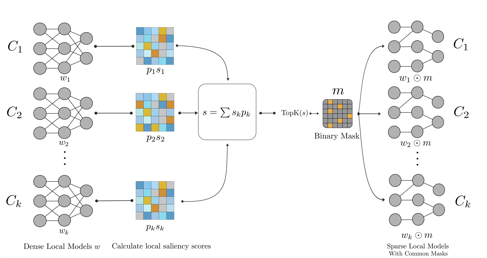

# SSFL: Discovering Unified Sparse Subspaces at Initialization for Efficient Federated Learning

https://openreview.net/forum?id=kUZ6LhUB26

[](https://openreview.net/forum?id=kUZ6LhUB26)
[](https://opensource.org/licenses/MIT)

**Authors:** Riyasat Ohib, Bishal Thapaliya, Gintare Karolina Dziugaite, Jingyu Liu, Vince D. Calhoun, Sergey Plis

## Abstract

Sparse federated learning aims to reduce communication costs and computational overhead in distributed machine learning by training sparse neural networks. However, existing methods often generate masks using generic pruning techniques that do not account for the federated learning setting's unique challenges, such as non-IID data distributions and heterogeneous client capabilities. In this work, we propose **SSFL (Sparse Salient Federated Learning)**, a framework that leverages gradient-based saliency scores to identify and preserve the most important parameters for federated learning. Our method generates a global sparse mask shared across all clients using SNIP (Single-shot Network Pruning) saliency computation, enabling efficient communication while maintaining model performance. We demonstrate that SSFL achieves significant communication reduction (up to 70% sparsity) with minimal accuracy degradation compared to dense federated learning baselines. Additionally, we show that a warm-up training phase with dense masks before mask generation leads to improved final model quality.

## Illustration of SSFL

<p align="center">
  
</p>

<p align="center">
  <strong>SSFL Framework:</strong> Global unified sparse mask generation using saliency-based pruning for efficient federated learning
</p>

The figure illustrates the key components of SSFL: (1) clients compute local saliency scores in parallel, (2) scores are aggregated to form a global saliency map, (3) a sparse mask is generated based on the global saliency, and (4) training proceeds with the shared sparse mask across all clients.

## Key Idea

Traditional federated learning transmits all model parameters, leading to high communication costs. Sparse federated learning addresses this by training only a subset of parameters, but existing approaches:

- Use generic pruning methods not optimized for federated settings
- Generate masks without considering parameter importance for distributed training
- Do not leverage gradient information to identify critical parameters

**Our solution:** SSFL introduces a saliency-based approach where:
- **Gradient-based saliency computation** (SNIP) identifies parameters most important for federated learning
- **Global sparse mask** is shared across all clients, ensuring consistent sparsity
- **Warm-up training** with dense masks improves mask quality before pruning
- **Communication efficiency** is achieved through sparse parameter transmission

---

## Method

### Core Contributions

1. **Saliency-Based Mask Generation:** We adapt SNIP (Single-shot Network Pruning) to the federated learning setting, computing saliency scores across distributed clients and aggregating them to form a global importance map.

2. **Static Sparse Masking:** A single sparse mask is generated after warm-up (or at initialization) and shared across all clients throughout training, ensuring consistent sparsity and efficient communication.

3. **Warm-Up Strategy:** Optional dense training phase before mask generation allows the model to learn important parameter relationships, leading to better mask quality and improved final performance.

4. **Random Baseline Variants:** We provide random masking baselines (global, layerwise, clientwise) for comprehensive comparison and ablation studies.

### Architecture

- **Client-side saliency computation:** Each client computes SNIP scores on local data
- **Aggregation:** Saliency scores are averaged across clients to form global importance
- **Mask generation:** Top-k parameters by global saliency are selected to form the sparse mask
- **Federated training:** Standard FedAvg aggregation with sparse parameter transmission


## Installation

### Requirements

- Python 3.8+
- PyTorch 1.10+
- CUDA-capable GPU (recommended)

### Setup

1. Clone this repository:
```bash
git clone https://github.com/yourusername/SSFL_public.git
cd SSFL_public
```

2. Install dependencies:
```bash
pip install torch torchvision numpy omegaconf wandb tqdm
```

3. Download datasets (CIFAR-10/100 will auto-download on first run):
   - Datasets are automatically downloaded to `data/` directory on first execution

## Usage

### Basic Training

Train SSFL with static masking on CIFAR-10:

```bash
python main.py \
  --config conf/base.yaml \
  --config conf/algorithm/ssfl.yaml \
  --config conf/algorithm/mode/static.yaml
```

### Configuration

The framework uses hierarchical YAML configuration files. Key parameters:

**Base Configuration (`conf/base.yaml`):**
```yaml
algorithm:
  name: ssfl
  params:
    mode: static
    method: ssfl
    warmup_rounds: 10  # Optional: train with dense mask first
    
model:
  name: resnet18
  dense_ratio: 0.3  # Keep 30% of parameters (70% sparsity)
  
dataset:
  name: cifar10
  partition_method: dir  # Dirichlet distribution
  partition_alpha: 0.3  # Non-IID level (lower = more non-IID)
  
training:
  client_num_in_total: 100
  frac: 0.1  # 10% of clients per round
  comm_round: 100
  epochs: 5  # Local epochs per round
```

### Example Configurations

**SSFL with Warm-up (Recommended):**
```bash
python main.py \
  --config conf/base.yaml \
  --config conf/algorithm/ssfl.yaml \
  --config conf/algorithm/mode/static.yaml
```

Edit `conf/algorithm/ssfl.yaml` to set `warmup_rounds: 10` for warm-up training.

**Random Baseline (for comparison):**
```bash
python main.py \
  --config conf/base.yaml \
  --config conf/algorithm/mode/random_global.yaml
```

### Experiment Tracking

The framework integrates with Weights & Biases:

```yaml
wandb:
  project: "ssfl-experiments"
  exp_name: "cifar10-resnet18-70sparse"
  mode: "online"  # or "offline", "disabled"
```

## Project Structure

```
SSFL_public/
├── main.py                 # Entry point
├── api/                    # Core framework code
│   ├── algorithms/        # SSFL algorithm runner
│   │   └── ssfl_runner.py
│   ├── client/           # Client management
│   │   ├── client.py
│   │   └── client_strategies.py
│   ├── masking/          # Masking strategies
│   │   ├── masking_strategy.py
│   │   └── random_masking.py
│   ├── model/            # Model architectures
│   │   ├── resnet.py     # ResNet-18 and ResNet-50
│   │   └── sparse_model.py
│   ├── saliency/         # Saliency calculation
│   │   ├── saliency.py   # SNIP implementation
│   │   └── saliency_utils.py
│   ├── trainers/         # Training logic
│   │   └── model_trainer.py
│   └── utils/            # Utilities
│       ├── stats_tracker.py
│       └── sparse_tools.py
├── conf/                  # Configuration files
│   ├── base.yaml
│   ├── algorithm/
│   │   ├── ssfl.yaml
│   │   └── mode/
│   │       ├── static.yaml
│   │       └── random_*.yaml
│   └── config_loader.py
├── data_preprocessing/    # Data partitioning
│   ├── cifar10_partitioner.py
│   └── cifar100_partitioner.py
├── jobs/                  # Example SLURM job scripts
│   ├── ssfl/             # SSFL experiment scripts
│   └── README_JOBS.md    # Job script documentation
└── README.md             # This file
```

## Citation

If you use this code in your research, please cite our paper:

```bibtex
@article{ohib2025communicationefficient,
  title   = {Communication-Efficient Sparse Federated Learning on Non-{IID} Datasets},
  author  = {Ohib, Riyasat and Thapaliya, Bishal and Dziugaite, Gintare Karolina and Liu, Jingyu and Calhoun, Vince D. and Plis, Sergey},
  journal = {Submitted to Transactions on Machine Learning Research},
  year    = {2025},
  url     = {https://openreview.net/forum?id=kUZ6LhUB26},
  note    = {Under review}
}
```

## License

This project is licensed under the MIT License - see the [LICENSE](LICENSE) file for details.

<!-- ## Acknowledgments

This work builds upon concepts from:
- **SNIP**: Single-shot Network Pruning based on connection sensitivity
- **FedAvg**: Federated Averaging algorithm
- The federated learning and neural network pruning communities -->

## Contact

For questions about the code or paper, please open an issue on GitHub or contact the authors.
