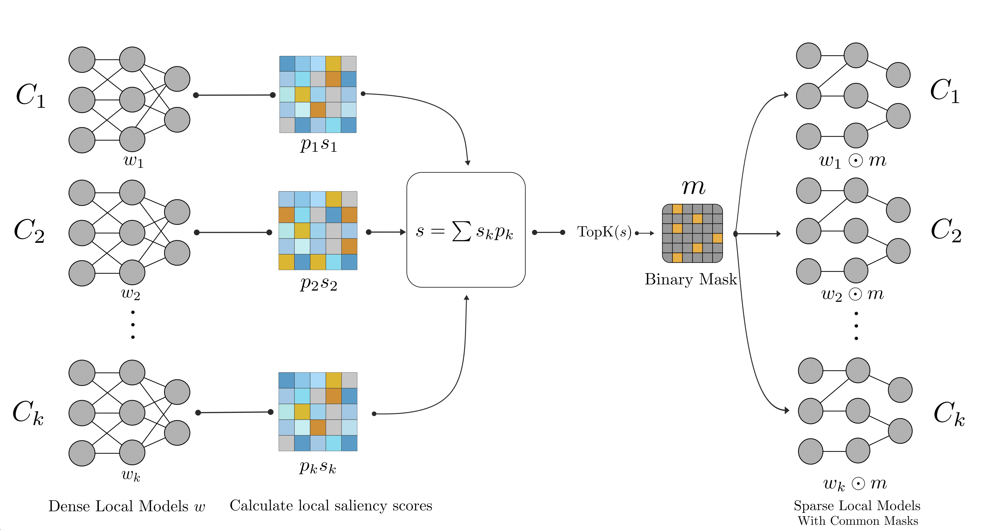

# SSFL: Discovering Unified Sparse Subnetworks at Initialization for Efficient Federated Learning

[](https://openreview.net/forum?id=kUZ6LhUB26) 
[](https://opensource.org/licenses/MIT)

**Authors:** Riyasat Ohib, Bishal Thapaliya, Gintare Karolina Dziugaite, Jingyu Liu, Vince D. Calhoun, Sergey Plis
<br>

----

## Abstract

In this work, we propose **Salient Sparse Federated Learning (SSFL)**, a streamlined approach for sparse federated learning with efficient communication. SSFL identifies a sparse subnetwork prior to training, leveraging parameter saliency scores computed separately on local client data in non-IID scenarios, and then aggregated, to determine a global mask. Only the sparse model weights are trained and communicated each round between the clients and the server. On standard benchmarks including CIFAR-10, CIFAR-100, and Tiny-ImageNet, SSFL consistently improves the accuracy–sparsity trade-off, achieving more than 20\% relative error reduction on CIFAR-10 compared to the strongest sparse baseline, while reducing communication costs by $2 \times$ relative to dense FL. Finally, in a real-world federated learning deployment, SSFL delivers over $2.3 \times$ faster communication time, underscoring its practical efficiency.

------

## Installation

### Requirements

- Python 3.10+
- [uv](https://github.com/astral-sh/uv) (fast Python package installer)
- PyTorch with CUDA support (installed automatically)
- CUDA-capable GPU (recommended)

### Setup

1. Clone this repository:
```bash
git clone https://github.com/riohib/SSFL.git
cd SSFL
```

2. Install dependencies using `uv`:
```bash
bash setup.sh
```

This will:
- Create a virtual environment (`.venv`) with Python 3.10
- Install PyTorch with CUDA 12.8 support
- Install all project dependencies

To use a different CUDA version:
```bash
CUDA_VERSION=cu128 bash setup.sh
```

3. Activate the environment:
```bash
source .venv/bin/activate
```

---

## Quick Start

### CIFAR-10 (ResNet-18)

```bash
python main.py \
  algorithm.name=ssfl \
  algorithm.params.mode=static \
  model.name=resnet18 \
  dataset.name=cifar10 \
  dataset.partition_alpha=0.3 \
  model.dense_ratio=0.5 \
  optimizer.lr=0.1 \
  optimizer.scheduler=default \
  training.client_num_in_total=100 \
  training.frac=0.1 \
  training.epochs=5 \
  training.comm_round=1000 \
  training.batch_size=16 \
  experiment.seed=550 \
  wandb.mode=offline \
  wandb.exp_name="C10_SSFL_dns0.5_seed550"
```

### CIFAR-100 (ResNet-18)

```bash
python main.py \
  algorithm.name=ssfl \
  algorithm.params.mode=static \
  model.name=resnet18 \
  dataset.name=cifar100 \
  dataset.partition_alpha=0.3 \
  model.dense_ratio=0.5 \
  optimizer.lr=0.1 \
  optimizer.scheduler=cosine_annealing \
  optimizer.momentum=0.9 \
  training.client_num_in_total=100 \
  training.frac=0.1 \
  training.epochs=10 \
  training.comm_round=1000 \
  training.batch_size=128 \
  experiment.seed=550 \
  wandb.mode=offline \
  wandb.exp_name="C100_SSFL_dns0.5_seed550"
```

### Configuration

The project uses [OmegaConf](https://omegaconf.readthedocs.io/) for configuration management. Configuration files are in `conf/`:

- `conf/base.yaml` — base defaults (dataset, model, optimizer, training)
- `conf/algorithm/ssfl.yaml` — SSFL algorithm defaults
- `conf/algorithm/mode/static.yaml` — static masking settings

Any parameter can be overridden via the command line using dot notation (e.g., `model.dense_ratio=0.5`). Set `wandb.mode=online` to log to Weights & Biases.

---

## Illustration of SSFL

<p align="center">
  
</p>

<p align="center">
  <strong>SSFL Framework:</strong> (1) Clients compute local saliency scores, (2) Server aggregates scores to form a global saliency score, (3) A unified sparse mask is generated, (4) Training proceeds within this fixed subspace.
</p>

## Key Idea

Traditional Federated Learning (FL) suffers from massive communication bottlenecks. While **Dynamic Sparse Training** (evolving masks) attempts to solve this, it introduces two fundamental problems:
1.  **Shifting Subspaces:** As clients evolve masks independently, they optimize in different parameter subspaces. Aggregating these disjoint models leads to destructive interference and "denser" effective global models.
2.  **Operational Complexity:** Dynamic methods require iterative pruning schedules, complex synchronization, and often public proxy datasets (violating privacy).

**The SSFL Solution:**
SSFL proposes a **Unified Sparse Subnetwork** (subspace) discovered *once* at initialization. SSFL can identify a globally performant sparse topology *before training starts* by aggregating local gradient-based saliency signals. 
* **Single-Shot Discovery:** No iterative prune-regrow cycles.
* **Privacy-Preserving:** Uses only private local gradients (no public proxy data needed).
* **Stability:** Forces all clients to optimize within the *same* sparse subspace, ensuring coherent aggregation.

---

## Method

SSFL operates in two distinct phases:

### Phase 1: Distributed Mask Discovery
1.  **Local Saliency Computation:** At initialization, each client $k$ samples a single minibatch and computes a saliency score $s_k$ for every parameter $w_j$ using the sensitivity criterion.
2.  **Weighted Aggregation:** To handle non-IID data, the server aggregates these weighted local scores, creating a global saliency map that represents the entire federation:
3.  **Global Mask Generation:** The server selects the Top-$k$ parameters from $s_{global}$ to create a binary mask $m$. This mask is broadcast to all clients once.

### Phase 2: Sparse Federated Training
Training proceeds using standard FedAvg, but restricted strictly to the discovered sparse subspace.

* **Computation:** Clients optimize the model only in the active subspace.


---

## Citation
If you find our work useful in your research, please cite our TMLR paper:

```bibtex
@article{
ohib2026ssfl,
title={{SSFL}: Discovering Sparse Unified Subnetworks at Initialization for Efficient Federated Learning},
author={Riyasat Ohib and Bishal Thapaliya and Gintare Karolina Dziugaite and Jingyu Liu and Vince D. Calhoun and Sergey Plis},
journal={Transactions on Machine Learning Research},
issn={2835-8856},
year={2026},
url={https://openreview.net/forum?id=kUZ6LhUB26},
note={}
}
